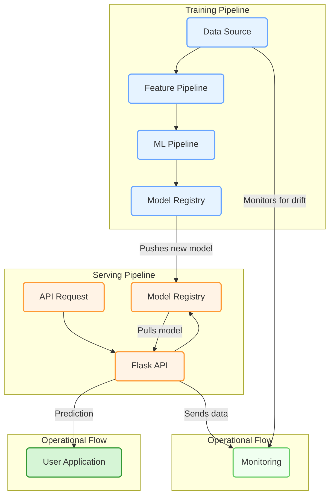

# Customer Churn Prediction System

A production-ready machine learning system for predicting customer churn, built with MLOps best practices.


## 🎯 Project Overview

This project implements an end-to-end machine learning pipeline for predicting customer churn in a telecommunications company. The system not only predicts which customers are likely to churn but also optimises for business value by calculating the ROI of retention campaigns.

### Key Features
- **Production-Ready API**: RESTful API with comprehensive error handling and logging
- **Business Value Optimisation**: Threshold tuning based on retention costs and success rates
- **MLOps Best Practices**: Experiment tracking, model versioning, and monitoring
- **Comprehensive Testing**: Unit tests, integration tests, and API tests
- **Containerised Deployment**: Docker-ready with health checks and monitoring

## 🏗️ Architecture


## 🚀 Quick Start

### Prerequisites
- Python 3.10+
- Conda
- Docker (optional)
- Git

### Installation

1. Clone the repository
```bash
git clone https://github.com/Muhammadali1029/churn-prediction-project.git
cd churn-prediction-project/churn-prediction
```

2. Create a new conda environment named 'your-env-name'
conda create --name your-env-name python=3.10

# Activate the conda environment
# On Unix-like systems (Linux/macOS)
conda activate your-env-name

# On Windows
# conda activate your-env-name


3. Install dependencies
pip install -r requirements.txt

4. Download the data 
Place the Telco Customer Churn dataset in data/raw/


## Training the Model
python scripts/train_production_model.py

## Running the API
python src/app.py

## Running with Docker
docker build -t churn-prediction .
docker run -p 5001:5001 churn-prediction

### 📊 Model Performance
AUC-ROC: 0.84

### API Endpoints

## Health Check
GET /health

## Single Prediction
POST /predict
Content-Type: application/json

{
  "customerID": "1234",
  "tenure": 12,
  "MonthlyCharges": 65.0,
  "Contract": "Month-to-month",
  ...
}

## Batch Prediction
POST /predict_batch
Content-Type: application/json

{
  "customers": [...]
}

### 📈 Business Impact
The model optimizes for business value by:

Calculating expected ROI for retention campaigns
Adjusting prediction thresholds based on retention costs
Prioritizing high-value customers at risk

Example results:

ROI: 245% average return on retention campaigns
Precision: 75% of targeted customers actually at risk
Coverage: Identifies 65% of all churning customers

### 🧪 Testing

## Run all tests:
pytest tests/ -v

## Run with coverage:
pytest tests/ --cov=src --cov-report=html

### 📁 Project Structure
churn-prediction/
├── src/
│   ├── app.py                 # Flask API
│   ├── analyse_logs.py        # Log analysis script
│   ├── business_optimiser.py  # Business value optimisation
│   ├── config.py              # Configuration file management
│   ├── data_downloader.py     # Data download script
│   ├── data_pipeline.py       # Data processing pipeline
│   ├── data_validator.py      # Data validation logic
│   ├── feature_engineering.py # Feature transformations
│   ├── logger_config.py       # Logger configuration
│   ├── model_pipeline.py      # Training pipeline
│   ├── model_utils.py         # Utility functions for models
│   ├── model.py               # Model definition
│   ├── monitoring_dashboard.py# Streamlit monitoring dashboard
│   ├── prediction_service.py  # Prediction logic
│   └── train.py               # Training script
├── tests/
│   ├── conftest.py            # Pytest configuration
│   ├── test_api.py            # API tests
│   └── test_model_pipeline.py # Model pipeline tests
├── notebooks/
│   ├── 01_eda.ipynb           # Exploratory analysis
│   └── 02_model_development.ipynb # Model development
├── scripts/
│   ├── curl_examples.sh       # cURL examples for API
│   ├── test_api.py            # API testing script
│   └── train_production_model.py # Script for training the final model

### 🛠️ Technologies Used
ML Framework: Scikit-learn, XGBoost, LightGBM
Experiment Tracking: MLflow
API Framework: Flask
Data Processing: Pandas, NumPy
Visualization: Matplotlib, Seaborn, Plotly
Testing: Pytest
Containerization: Docker
Monitoring: Streamlit

### 📚 Lessons Learned
1. Simple models often outperform complex ones when properly tuned
2. Business metrics > ML metrics for real-world impact
3. Class imbalance significantly affects model behavior
4. Feature engineering can be more valuable than model complexity

### 🔮 Future Improvements
Add real-time model monitoring and alerting
Implement A/B testing framework
Add automated retraining pipeline
Build interactive web interface
Add explainability features (SHAP/LIME)

### 👤 Author
Muhammad Ali

GitHub: @Muhammadali1029
LinkedIn: @muhammadali29
Portfolio: muhammadalisyed.com

### 📄 License
This project is licensed under the MIT License - see the LICENSE file for details.